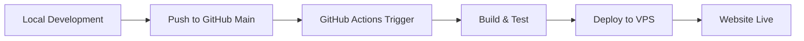

# 🚀 Detailed Guide: Upload Source Code from GitHub Main to VPS

## 📋 Process Overview



## 🛠️ Step 1: Prepare VPS

### 1.1. Create domain in Virtualmin
```bash
# Login to Virtualmin and create new domain
# Domain will automatically create structure: /home/domain.com/public_html
```

### 1.2. Install SSH Key on VPS
```bash
# On local machine, create SSH key pair
ssh-keygen -t rsa -b 4096 -C "github-actions@yourdomain.com"

# Copy public key to VPS
ssh-copy-id username@your-vps-ip

# Or manual copy:
cat ~/.ssh/id_rsa.pub | ssh username@your-vps-ip "mkdir -p ~/.ssh && cat >> ~/.ssh/authorized_keys"
```

### 1.3. Test SSH connection
```bash
# Test SSH connection without password
ssh username@your-vps-ip "echo 'SSH connection successful'"
```

## 📁 Step 2: Prepare Source Code

### 2.1. Create or clone project
```bash
# Option 1: Create new project
mkdir my-laravel-app
cd my-laravel-app
git init

# Option 2: Clone existing project
git clone https://github.com/username/my-project.git
cd my-project
```

### 2.2. Use Docker setup to add GitHub Actions
```bash
# Run Docker setup script
cd /path/to/Docker
./scripts/setup.sh

# Select existing project from ../Projects/
# Script will ask if you want to setup GitHub Actions
# Choose appropriate template (Laravel, CodeIgniter, Vue.js, Flutter, etc.)
```

## ⚙️ Step 3: Configure GitHub Repository

### 3.1. Create repository on GitHub
```bash
# Create repo on GitHub (via web interface)
# Or use GitHub CLI
gh repo create my-project --public
```

### 3.2. Setup GitHub Secrets
Go to **Settings** → **Secrets and variables** → **Actions** and add:

#### Required Secrets (All templates):
```bash
VPS_SSH_KEY     # Content of private key (~/.ssh/id_rsa)
VPS_HOST        # VPS IP or hostname (e.g., 192.168.1.100)
VPS_USER        # VPS username (e.g., root or domain user)
DOMAIN_NAME     # Domain name (e.g., example.com)
```

#### Laravel/CodeIgniter specific:
```bash
DB_HOST         # localhost
DB_DATABASE     # database_name
DB_USERNAME     # db_username
DB_PASSWORD     # db_password
APP_URL         # https://example.com
```

#### Laravel specific:
```bash
APP_KEY         # php artisan key:generate --show
```

### 3.3. Copy Private SSH Key
```bash
# Copy private key content
cat ~/.ssh/id_rsa

# Paste into GitHub Secret VPS_SSH_KEY
# Include -----BEGIN/END PRIVATE KEY-----
```

## 🔧 Step 4: Configure GitHub Actions Workflow

### 4.1. Check workflow file
```bash
# File automatically created by setup script
ls -la .github/workflows/

# Content of deploy-vps.yml file
cat .github/workflows/deploy-vps.yml
```

### 4.2. Customize workflow (if needed)
```yaml
# .github/workflows/deploy-vps.yml
name: Deploy to VPS

on:
  push:
    branches: [ main ]  # Trigger when pushing to main
  pull_request:
    branches: [ main ]
    types: [ closed ]   # Trigger when merging PR

# ... rest of workflow
```

## 📤 Step 5: Deploy to GitHub

### 5.1. Add and commit files
```bash
# Add all files
git add .

# Commit with clear message
git commit -m "feat: initial project setup with GitHub Actions deployment"

# Add remote origin (if not exists)
git remote add origin https://github.com/username/my-project.git
```

### 5.2. Push to main branch
```bash
# Push to GitHub main branch
git push -u origin main

# GitHub Actions will automatically trigger
```

## 🎯 Step 6: Monitor Deployment

### 6.1. View GitHub Actions logs
1. Go to GitHub repository
2. Click **Actions** tab
3. Click on running workflow
4. View real-time logs

### 6.2. Monitor deployment steps
```bash
# GitHub Actions will perform:
1. ✅ Checkout code
2. ✅ Setup PHP/Node.js
3. ✅ Install dependencies
4. ✅ Run tests
5. ✅ Setup SSH connection
6. ✅ Create backup on VPS
7. ✅ Sync files to VPS
8. ✅ Configure application
9. ✅ Set permissions
10. ✅ Verify deployment
```

## 🔍 Step 7: Verification & Troubleshooting

### 7.1. Check website
```bash
# Test website accessibility
curl -I https://yourdomain.com

# Check in browser
open https://yourdomain.com
```

### 7.2. Check files on VPS
```bash
# SSH to VPS and check
ssh username@your-vps-ip

# Check structure
ls -la /home/yourdomain.com/
ls -la /home/yourdomain.com/public_html/

# Check permissions
ls -la /home/yourdomain.com/public_html/
```

### 7.3. View logs if errors occur
```bash
# VPS web server logs
tail -f /var/log/apache2/error.log
# or
tail -f /var/log/nginx/error.log

# Application logs (Laravel)
tail -f /home/yourdomain.com/laravel-app/storage/logs/laravel.log
```

## 🔄 Step 8: Continuous Deployment

### 8.1. Daily workflow
```bash
# 1. Develop locally
git checkout -b feature/new-feature
# ... make changes ...

# 2. Test and commit
git add .
git commit -m "feat: add new feature"
git push origin feature/new-feature

# 3. Create Pull Request on GitHub

# 4. Merge PR to main
# → GitHub Actions will automatically deploy to VPS
```

### 8.2. Hotfix deployment
```bash
# For urgent fixes
git checkout main
git pull origin main

# Make quick fix
git add .
git commit -m "hotfix: critical bug fix"
git push origin main

# → Deployment will trigger immediately
```

## 📊 Step 9: Monitoring & Maintenance

### 9.1. Backup management
```bash
# Backups are automatically created in /home/domain/backups/
# Keep 5 most recent backups
ssh username@vps-ip "ls -la /home/yourdomain.com/backups/"
```

### 9.2. Performance monitoring
```bash
# Check response time
curl -w "%{time_total}" -o /dev/null -s https://yourdomain.com

# Check resource usage on VPS
ssh username@vps-ip "htop"
```

## 🚨 Troubleshooting Common Issues

### Issue 1: SSH Connection Failed
```bash
Error: Permission denied (publickey)

Solution:
1. Check if SSH key has been added to VPS
2. Verify VPS_SSH_KEY secret format
3. Test SSH connection manually: ssh -i ~/.ssh/id_rsa username@vps-ip
```

### Issue 2: File Permissions
```bash
Error: 403 Forbidden

Solution:
1. SSH to VPS
2. Fix permissions:
   chmod -R 755 /home/yourdomain.com/public_html
   chown -R username:username /home/yourdomain.com/
```

### Issue 3: Database Connection
```bash
Error: Database connection failed

Solution:
1. Check database credentials in GitHub Secrets
2. Verify database exists on VPS
3. Test connection: mysql -h DB_HOST -u DB_USERNAME -p
```

### Issue 4: Laravel/CodeIgniter Specific
```bash
Error: 500 Internal Server Error

Laravel Solution:
1. Check .env file: ssh vps "cat /home/domain/laravel-app/.env"
2. Check APP_KEY: php artisan key:generate
3. Storage permissions: chmod -R 775 storage bootstrap/cache

CodeIgniter Solution:
1. Check base_url in config
2. Verify database config
3. Check .htaccess file
```

## 📈 Advanced Tips

### Tip 1: Multiple Environments
```yaml
# Deploy to staging and production
on:
  push:
    branches: [ main ]     # → Production
    branches: [ develop ]  # → Staging
```

### Tip 2: Conditional Deployment
```yaml
# Deploy only when specific changes occur
on:
  push:
    paths:
      - 'app/**'
      - 'database/**'
      - 'public/**'
```

### Tip 3: Slack Notifications
```yaml
# Add notification step
- name: Notify Slack
  if: always()
  uses: 8398a7/action-slack@v3
  with:
    status: ${{ job.status }}
    webhook_url: ${{ secrets.SLACK_WEBHOOK }}
```

## 🎉 Conclusion

After completing all the steps above, you will have:

✅ **Automatic Deployment**: Push to main → Auto deploy to VPS
✅ **Backup System**: Automatic backup before each deployment
✅ **Testing Pipeline**: Code is tested before deployment
✅ **Error Monitoring**: Logs and notifications when errors occur
✅ **Rollback Capability**: Can restore from backup when needed

**Workflow Summary:**
```
Local Development → Git Push → GitHub Actions → VPS Deployment → Live Website
```

Now you can focus on development, deployment will be handled automatically! 🚀
