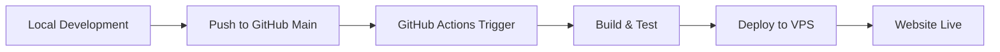

# 🚀 Hướng Dẫn Chi Tiết: Upload Source Code từ GitHub Main lên VPS

## 📋 Tổng quan quy trình



## 🛠️ Bước 1: Chuẩn bị VPS

### 1.1. Tạo domain trong Virtualmin
```bash
# Đăng nhập Virtualmin và tạo domain mới
# Domain sẽ tự động tạo cấu trúc: /home/domain.com/public_html
```

### 1.2. Cài đặt SSH Key trên VPS
```bash
# Trên máy local, tạo SSH key pair
ssh-keygen -t rsa -b 4096 -C "github-actions@yourdomain.com"

# Copy public key lên VPS
ssh-copy-id username@your-vps-ip

# Hoặc manual copy:
cat ~/.ssh/id_rsa.pub | ssh username@your-vps-ip "mkdir -p ~/.ssh && cat >> ~/.ssh/authorized_keys"
```

### 1.3. Test SSH connection
```bash
# Test kết nối SSH không cần password
ssh username@your-vps-ip "echo 'SSH connection successful'"
```

## 📁 Bước 2: Chuẩn bị Source Code

### 2.1. Tạo hoặc clone project
```bash
# Option 1: Tạo project mới
mkdir my-laravel-app
cd my-laravel-app
git init

# Option 2: Clone existing project
git clone https://github.com/username/my-project.git
cd my-project
```

### 2.2. Sử dụng Docker setup để thêm GitHub Actions
```bash
# Chạy Docker setup script
cd /path/to/Docker
./scripts/setup.sh

# Chọn existing project từ ../Projects/
# Script sẽ hỏi có muốn setup GitHub Actions không
# Chọn template phù hợp (Laravel, CodeIgniter, Vue.js, Flutter, etc.)
```

## ⚙️ Bước 3: Cấu hình GitHub Repository

### 3.1. Tạo repository trên GitHub
```bash
# Tạo repo trên GitHub (via web interface)
# Hoặc sử dụng GitHub CLI
gh repo create my-project --public
```

### 3.2. Setup GitHub Secrets
Vào **Settings** → **Secrets and variables** → **Actions** và thêm:

#### Required Secrets (Tất cả templates):
```bash
VPS_SSH_KEY     # Content của private key (~/.ssh/id_rsa)
VPS_HOST        # IP hoặc hostname của VPS (e.g., 192.168.1.100)
VPS_USER        # Username VPS (e.g., root hoặc domain user)
DOMAIN_NAME     # Domain name (e.g., example.com)
```

#### Laravel/CodeIgniter specific:
```bash
DB_HOST         # localhost
DB_DATABASE     # database_name
DB_USERNAME     # db_username
DB_PASSWORD     # db_password
APP_URL         # https://example.com
```

#### Laravel specific:
```bash
APP_KEY         # php artisan key:generate --show
```

### 3.3. Copy Private SSH Key
```bash
# Copy nội dung private key
cat ~/.ssh/id_rsa

# Paste vào GitHub Secret VPS_SSH_KEY
# Bao gồm cả -----BEGIN/END PRIVATE KEY-----
```

## 🔧 Bước 4: Cấu hình GitHub Actions Workflow

### 4.1. Kiểm tra workflow file
```bash
# File được tạo tự động bởi setup script
ls -la .github/workflows/

# Nội dung file deploy-vps.yml
cat .github/workflows/deploy-vps.yml
```

### 4.2. Customize workflow (nếu cần)
```yaml
# .github/workflows/deploy-vps.yml
name: Deploy to VPS

on:
  push:
    branches: [ main ]  # Trigger khi push lên main
  pull_request:
    branches: [ main ]
    types: [ closed ]   # Trigger khi merge PR

# ... rest of workflow
```

## 📤 Bước 5: Deploy lên GitHub

### 5.1. Add và commit files
```bash
# Add tất cả files
git add .

# Commit với message rõ ràng
git commit -m "feat: initial project setup with GitHub Actions deployment"

# Thêm remote origin (nếu chưa có)
git remote add origin https://github.com/username/my-project.git
```

### 5.2. Push lên main branch
```bash
# Push lên GitHub main branch
git push -u origin main

# GitHub Actions sẽ tự động trigger
```

## 🎯 Bước 6: Theo dõi Deployment

### 6.1. Xem GitHub Actions logs
1. Vào GitHub repository
2. Click tab **Actions**
3. Click vào workflow đang chạy
4. Xem real-time logs

### 6.2. Monitor deployment steps
```bash
# GitHub Actions sẽ thực hiện:
1. ✅ Checkout code
2. ✅ Setup PHP/Node.js
3. ✅ Install dependencies
4. ✅ Run tests
5. ✅ Setup SSH connection
6. ✅ Create backup on VPS
7. ✅ Sync files to VPS
8. ✅ Configure application
9. ✅ Set permissions
10. ✅ Verify deployment
```

## 🔍 Bước 7: Verification & Troubleshooting

### 7.1. Kiểm tra website
```bash
# Test website accessibility
curl -I https://yourdomain.com

# Kiểm tra trong browser
open https://yourdomain.com
```

### 7.2. Kiểm tra files trên VPS
```bash
# SSH vào VPS và kiểm tra
ssh username@your-vps-ip

# Kiểm tra structure
ls -la /home/yourdomain.com/
ls -la /home/yourdomain.com/public_html/

# Kiểm tra permissions
ls -la /home/yourdomain.com/public_html/
```

### 7.3. Xem logs nếu có lỗi
```bash
# VPS web server logs
tail -f /var/log/apache2/error.log
# hoặc
tail -f /var/log/nginx/error.log

# Application logs (Laravel)
tail -f /home/yourdomain.com/laravel-app/storage/logs/laravel.log
```

## 🔄 Bước 8: Continuous Deployment

### 8.1. Workflow hàng ngày
```bash
# 1. Develop locally
git checkout -b feature/new-feature
# ... make changes ...

# 2. Test và commit
git add .
git commit -m "feat: add new feature"
git push origin feature/new-feature

# 3. Tạo Pull Request trên GitHub

# 4. Merge PR vào main
# → GitHub Actions sẽ tự động deploy lên VPS
```

### 8.2. Hotfix deployment
```bash
# Cho urgent fixes
git checkout main
git pull origin main

# Make quick fix
git add .
git commit -m "hotfix: critical bug fix"
git push origin main

# → Deployment sẽ trigger ngay lập tức
```

## 📊 Bước 9: Monitoring & Maintenance

### 9.1. Backup management
```bash
# Backups được tạo tự động trong /home/domain/backups/
# Giữ lại 5 backups gần nhất
ssh username@vps-ip "ls -la /home/yourdomain.com/backups/"
```

### 9.2. Performance monitoring
```bash
# Kiểm tra response time
curl -w "%{time_total}" -o /dev/null -s https://yourdomain.com

# Kiểm tra resource usage trên VPS
ssh username@vps-ip "htop"
```

## 🚨 Troubleshooting Common Issues

### Issue 1: SSH Connection Failed
```bash
Error: Permission denied (publickey)

Solution:
1. Kiểm tra SSH key đã được add vào VPS chưa
2. Verify VPS_SSH_KEY secret format
3. Test SSH connection manually: ssh -i ~/.ssh/id_rsa username@vps-ip
```

### Issue 2: File Permissions
```bash
Error: 403 Forbidden

Solution:
1. SSH vào VPS
2. Fix permissions:
   chmod -R 755 /home/yourdomain.com/public_html
   chown -R username:username /home/yourdomain.com/
```

### Issue 3: Database Connection
```bash
Error: Database connection failed

Solution:
1. Kiểm tra database credentials trong GitHub Secrets
2. Verify database tồn tại trên VPS
3. Test connection: mysql -h DB_HOST -u DB_USERNAME -p
```

### Issue 4: Laravel/CodeIgniter Specific
```bash
Error: 500 Internal Server Error

Laravel Solution:
1. Kiểm tra .env file: ssh vps "cat /home/domain/laravel-app/.env"
2. Check APP_KEY: php artisan key:generate
3. Storage permissions: chmod -R 775 storage bootstrap/cache

CodeIgniter Solution:
1. Kiểm tra base_url trong config
2. Verify database config
3. Check .htaccess file
```

## 📈 Advanced Tips

### Tip 1: Multiple Environments
```yaml
# Deploy to staging và production
on:
  push:
    branches: [ main ]     # → Production
    branches: [ develop ]  # → Staging
```

### Tip 2: Conditional Deployment
```yaml
# Deploy chỉ khi có changes cụ thể
on:
  push:
    paths:
      - 'app/**'
      - 'database/**'
      - 'public/**'
```

### Tip 3: Slack Notifications
```yaml
# Thêm notification step
- name: Notify Slack
  if: always()
  uses: 8398a7/action-slack@v3
  with:
    status: ${{ job.status }}
    webhook_url: ${{ secrets.SLACK_WEBHOOK }}
```

## 🎉 Conclusion

Sau khi hoàn thành tất cả bước trên, bạn sẽ có:

✅ **Automatic Deployment**: Push to main → Auto deploy to VPS
✅ **Backup System**: Tự động backup trước mỗi deployment
✅ **Testing Pipeline**: Code được test trước khi deploy
✅ **Error Monitoring**: Logs và notifications khi có lỗi
✅ **Rollback Capability**: Có thể restore từ backup khi cần

**Workflow Summary:**
```
Local Development → Git Push → GitHub Actions → VPS Deployment → Live Website
```

Giờ bạn có thể focus vào development, deployment sẽ được handle tự động! 🚀
