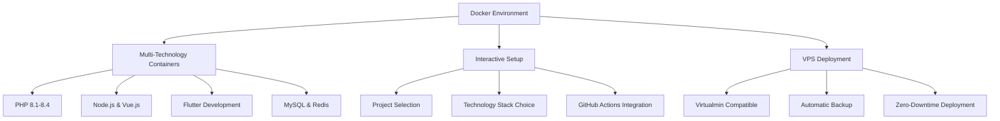

# 📚 QUOCNHO Docker Development Environment

Comprehensive documentation for the QUOCNHO team's multi-technology Docker development environment. This system provides standardized containerized development environments for PHP/Laravel/CodeIgniter/Symfony, Flutter, Vue.js/PWA, and Node.js projects.

## 🎯 Overview

This Docker environment is designed for **team consistency** and **professional deployment workflows**. It supports multiple technology stacks with automatic VPS deployment through GitHub Actions integration.

### 🏗️ Architecture



## 📁 Project Structure

```
Docker/
├── 🐳 containers/              # Docker configurations
│   ├── docker-compose.yml     # Main services definition
│   ├── docker-compose.setup.yml # Development setup
│   ├── Dockerfile             # PHP web container
│   ├── Dockerfile.flutter     # Flutter development container
│   └── mysql/                 # Database initialization
│       ├── fukoji.sql         # Sample database
│       └── init.sql           # Initial setup
│
├── ⚙️ configs/               # Technology-specific configs
│   ├── php/                  # PHP & Xdebug configuration
│   ├── nodejs/               # Node.js settings
│   ├── flutter/              # Flutter development config
│   ├── mysql/                # MySQL optimization
│   ├── nginx/                # Web server configuration
│   └── redis/                # Redis caching config
│
├── 🚀 scripts/               # Management & automation
│   ├── setup.sh              # Interactive project setup
│   ├── start.sh              # Start development environment
│   ├── stop.sh               # Stop containers
│   ├── container-helper.sh   # Container management utilities
│   ├── check-requirements.sh # System requirements validation
│   └── check-port-conflicts.sh # Port conflict prevention
│
├── 📝 templates/             # Project & deployment templates
│   ├── laravel/              # Laravel project templates
│   ├── codeigniter/          # CodeIgniter templates
│   ├── vue-pwa/              # Vue.js PWA templates
│   ├── flutter/              # Flutter app templates
│   └── github-actions/       # VPS deployment workflows
│       ├── laravel-vps.yml   # Laravel deployment
│       ├── codeigniter-vps.yml # CodeIgniter deployment
│       ├── vue-vps.yml       # Vue.js deployment
│       ├── flutter-web-vps.yml # Flutter web deployment
│       └── vps-deployment.yml # Generic VPS deployment
│
├── 📖 docs/                  # Documentation
│   ├── README.md             # This file
│   ├── DEPLOYMENT_GUIDE.md   # Step-by-step deployment guide
│   └── MULTI_PROJECT_GUIDE.md # Multi-project management
│
└── 📋 requirements/          # System requirements
    ├── docker/               # Docker requirements
    ├── php/                  # PHP stack requirements
    └── system/               # System-level requirements
```

## 🚀 Quick Start

### 1. Initial Setup
```bash
# Clone the Docker environment
git clone https://github.com/quocnho/docker4fullstack.git Docker
cd Docker

# Check system requirements
./scripts/check-requirements.sh

# Interactive setup
./scripts/setup.sh
```

### 2. Project Selection Workflow
The setup script provides an interactive menu:

```
🐳 QUOCNHO Docker Environment Setup

Select Project:
  0) ➕ Create new project
  1) 📁 restaurant-pos (Laravel)
  2) 📁 ecommerce-vue (Vue.js PWA)
  3) 📁 mobile-flutter (Flutter)

Choose technology stack:
  ☑️ Web (PHP 8.3)
  ☑️ MySQL Database
  ☑️ Redis Cache
  ☑️ Node.js & NPM
  ☐ Flutter Development
  ☐ Nginx Load Balancer

GitHub Actions Integration:
  ☑️ Setup VPS deployment workflow

Select deployment template:
  1) 🔄 General VPS Deployment
  2) 🎯 Laravel VPS Deployment
  3) 🚀 CodeIgniter VPS Deployment
  4) 💎 Vue.js PWA VPS Deployment
  5) 📱 Flutter Web VPS Deployment
```

### 3. Daily Development Workflow
```bash
# Start development environment
./scripts/start.sh

# Monitor containers
./scripts/container-helper.sh status

# View logs
./scripts/container-helper.sh logs web 50

# Enter containers
./scripts/container-helper.sh exec web bash
./scripts/container-helper.sh exec nodejs npm install
./scripts/container-helper.sh exec flutter flutter doctor

# Stop environment
./scripts/stop.sh
```

## 🛠️ Technology Support

### 🐘 PHP Development
- **Versions**: PHP 8.1, 8.2, 8.3, 8.4
- **Frameworks**: Laravel, CodeIgniter 3/4, Symfony
- **Tools**: Composer, Xdebug (VS Code ready)
- **Extensions**: All common PHP extensions pre-installed

### 🟢 Node.js & Frontend
- **Node.js**: Latest LTS version
- **Frameworks**: Vue.js, React, Angular
- **Tools**: NPM, Yarn, Vue CLI, PWA support
- **Build**: Vite, Webpack optimization

### 📱 Flutter Development
- **SDK**: Latest stable Flutter
- **Platforms**: Web, Android, iOS development
- **Tools**: Flutter Doctor, Hot Reload
- **Integration**: VS Code Flutter extensions

### 🗄️ Database & Caching
- **MySQL**: 8.0 with optimization
- **Redis**: Latest stable for caching
- **phpMyAdmin**: Web interface included
- **Backup**: Automatic database backups

## 🌐 VPS Deployment Features

### 🔄 Automatic Deployment Pipeline
```
Local Development → GitHub Push → Actions Trigger → VPS Deployment → Live Website
```

### 🎯 Deployment Templates
1. **General VPS**: Universal deployment for any PHP project
2. **Laravel**: Laravel-specific with Artisan commands
3. **CodeIgniter**: CI3/CI4 with auto-detection
4. **Vue.js PWA**: Frontend build and optimization
5. **Flutter Web**: Flutter web compilation and deployment

### 🛡️ Safety Features
- **Automatic Backups**: Before each deployment
- **Health Checks**: Verify deployment success
- **Rollback Capability**: Restore from backups
- **Zero Downtime**: Seamless deployments
- **Security Headers**: Automatic security configuration

## 📋 Project Configuration

Each project uses a `.denv` file for configuration:

```bash
# Example .denv file
PROJECT_NAME=restaurant-pos
CONTAINERS=web,mysql,redis,nodejs
PHP_VERSION=8.3
WEB_PORT=8080
DB_PORT=3306
REDIS_PORT=6379
NODE_PORT=3000

# Database Configuration
DB_HOST=mysql
DB_DATABASE=restaurant_pos
DB_USERNAME=app_user
DB_PASSWORD=secure_password

# Application URLs
APP_URL=http://restaurant-pos.dev
API_URL=http://restaurant-pos.dev/api
```

## 🔧 Advanced Features

### 🔍 Multi-Project Management
- **Isolation**: Each project runs independently
- **Port Management**: Automatic port conflict resolution
- **Resource Sharing**: Shared base images for efficiency
- **Easy Switching**: Quick project switching commands

### 🎛️ Development Tools Integration
- **VS Code**: Ready-to-use configurations
- **Xdebug**: Step debugging with IDE integration
- **Hot Reload**: Automatic code reloading
- **Live Reload**: Browser auto-refresh

### 📊 Monitoring & Logging
- **Container Logs**: Centralized logging system
- **Performance Monitoring**: Resource usage tracking
- **Error Tracking**: Automatic error detection
- **Health Checks**: Container health monitoring

## 🚀 Team Workflows

### 👥 Onboarding New Team Members
```bash
# 1. Clone Docker environment
git clone https://github.com/quocnho/docker4fullstack.git Docker

# 2. Run requirements check
cd Docker && ./scripts/check-requirements.sh

# 3. Setup project
./scripts/setup.sh
# Select existing project from ../Projects/

# 4. Start development
./scripts/start.sh
```

### 🔄 Daily Development Cycle
```bash
# Morning startup
cd Docker && ./scripts/start.sh

# Development work in ../Projects/{project-name}/
# All containers accessible via project.dev

# Evening shutdown
./scripts/stop.sh
```

### 🚀 Deployment Workflow
```bash
# Code changes
git add .
git commit -m "feat: new feature"
git push origin main

# GitHub Actions automatically:
# 1. Run tests
# 2. Build application
# 3. Deploy to VPS
# 4. Verify deployment
# 5. Send notifications
```

## 📚 Documentation Links

- 📖 **[Deployment Guide](DEPLOYMENT_GUIDE.md)**: Step-by-step VPS deployment
- 🔀 **[Multi-Project Guide](MULTI_PROJECT_GUIDE.md)**: Managing multiple projects
- 🐳 **[Container Configurations](../containers/README.md)**: Docker setup details
- ⚙️ **[Configuration Files](../configs/README.md)**: Technology-specific configs
- 📋 **[Requirements](../requirements/README.md)**: System requirements

## 💡 Key Benefits

### ✅ **Team Consistency**
- Identical development environments across all team members
- Standardized technology stacks and versions
- Consistent deployment procedures

### ✅ **Professional Deployment**
- Automated VPS deployment with GitHub Actions
- Zero-downtime deployments with automatic backups
- Virtualmin-compatible directory structure

### ✅ **Developer Experience**
- Interactive setup with technology selection
- Hot reload and live debugging capabilities
- Easy project switching and management

### ✅ **Scalability**
- Support for multiple simultaneous projects
- Modular container system
- Easy addition of new technologies

## 🎯 Use Cases

### 🏢 **Agency Development**
Perfect for development agencies handling multiple client projects with different technology requirements.

### 👥 **Team Collaboration**
Ensures all team members have identical development environments regardless of their local machine setup.

### 🚀 **Rapid Prototyping**
Quick project setup with pre-configured templates for common technology stacks.

### 📱 **Full-Stack Development**
Supports backend (PHP/Laravel), frontend (Vue.js/PWA), and mobile (Flutter) development in one environment.

### 🌐 **Production Deployment**
Professional-grade VPS deployment with automatic testing, backup, and rollback capabilities.

---

## 🎉 Getting Started

Ready to streamline your development workflow? Start with:

```bash
git clone https://github.com/quocnho/docker4fullstack.git Docker
cd Docker
./scripts/setup.sh
```

The interactive setup will guide you through project selection, technology stack configuration, and optional VPS deployment setup.

**Happy Coding!** 🚀
